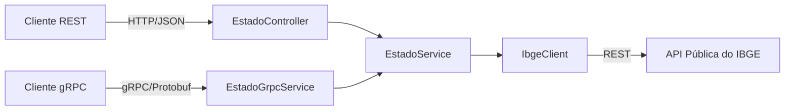
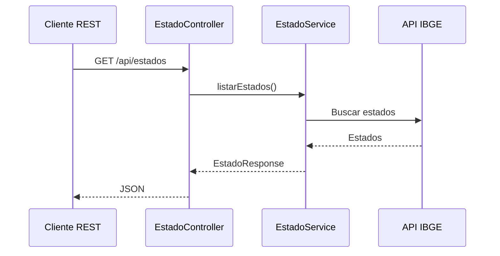
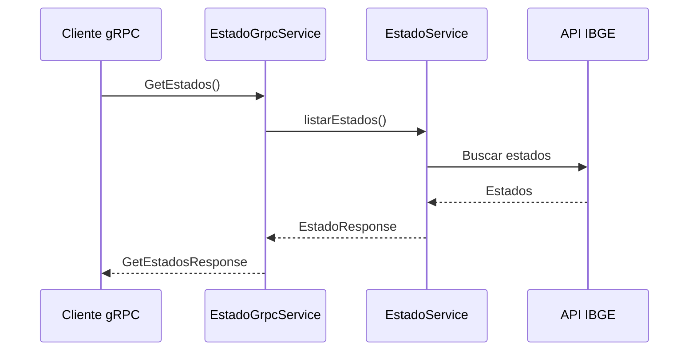

# Brasil Data API

API para consulta e exposição de dados públicos brasileiros, utilizando dados do IBGE como fonte externa.

O projeto foi desenvolvido como um projeto de estudo com foco em **desenvolvimento de APIs, integração com serviços externos e comunicação entre sistemas**, explorando diferentes abordagens de comunicação como **REST e gRPC**.

Além da implementação funcional, o projeto busca aplicar conceitos utilizados no desenvolvimento de APIs modernas, como separação de responsabilidades, injeção de dependências, contratos de comunicação, tratamento de erros e reutilização da camada de negócio.

---

## ✨ Visão Geral

O **Brasil Data API** é uma aplicação backend desenvolvida em Java e Spring Boot que disponibiliza informações públicas brasileiras através de diferentes interfaces de comunicação.

Atualmente, o projeto utiliza a API pública do **IBGE** como fonte de dados e disponibiliza informações de estados brasileiros através de:

- 📦 Consulta de estados brasileiros
- 🌐 API REST
- ⚡ API gRPC
- 📦 Protocol Buffers
- 🔗 Integração com API pública do IBGE

O projeto foi criado principalmente com objetivo educacional, permitindo estudar na prática como diferentes tecnologias de comunicação podem coexistir utilizando a mesma camada de negócio.

---

## 🚀 Principais Recursos

- 📦 Consulta de estados brasileiros
- 🌐 Endpoint REST para consulta de estados
- ⚡ Endpoint gRPC para consulta de estados
- 📦 Contratos definidos utilizando Protocol Buffers
- 🔗 Integração com API pública do IBGE
- 🔄 Reutilização da camada de negócio entre REST e gRPC
- ⚠️ Tratamento global de exceções
- 📋 Respostas estruturadas utilizando `ProblemDetail`
- 💉 Injeção de dependências utilizando Spring
- 🧩 Separação entre integração externa, negócio e interfaces de comunicação

---

## 🏗️ Arquitetura

O projeto utiliza uma arquitetura baseada na separação de responsabilidades.

As interfaces REST e gRPC funcionam como diferentes portas de entrada para a mesma camada de negócio.

```text
                    ┌─────────────────────┐
                    │      REST API       │
                    │ EstadoController    │
                    └──────────┬──────────┘
                               │
                               ▼
                    ┌─────────────────────┐
                    │    EstadoService    │
                    │   Regra de negócio  │
                    └──────────┬──────────┘
                               │
                               ▼
                    ┌─────────────────────┐
                    │     IbgeClient      │
                    │ Integração externa  │
                    └──────────┬──────────┘
                               │
                               ▼
                    ┌─────────────────────┐
                    │     API do IBGE     │
                    └─────────────────────┘


                    ┌─────────────────────┐
                    │      gRPC API       │
                    │ EstadoGrpcService   │
                    └──────────┬──────────┘
                               │
                               ▼
                         EstadoService
```

### Princípio principal

REST e gRPC possuem diferentes contratos e mecanismos de comunicação, mas compartilham a mesma lógica de negócio.

```text
REST ───────────────┐
                    │
                    ▼
              EstadoService
                    │
                    ▼
                IbgeClient
                    │
                    ▼
                   IBGE
                    ▲
                    │
gRPC ───────────────┘
```

Essa abordagem evita duplicação da regra de negócio e permite adicionar novas interfaces de comunicação sem alterar a lógica principal da aplicação.

---

## 📁 Estrutura do Projeto

```text
BrasilDataAPI
├── src
│   ├── main
│   │   ├── java
│   │   │   └── br.com.estudos.brasildataapi
│   │   │       ├── client
│   │   │       │   └── IbgeClient
│   │   │       ├── config
│   │   │       │   └── RestClientConfig
│   │   │       ├── controller
│   │   │       │   └── EstadoController
│   │   │       ├── dto
│   │   │       │   ├── EstadoResponse
│   │   │       │   └── IbgeEstadoResponse
│   │   │       ├── exception
│   │   │       │   ├── GlobalExceptionHandler
│   │   │       │   └── IbgeIntegrationException
│   │   │       ├── grpc
│   │   │       │   └── EstadoGrpcService
│   │   │       └── service
│   │   │           └── EstadoService
│   │   └── proto
│   │       └── estado.proto
│   └── test
├── pom.xml
└── README.md
```

---

## 📊 Diagrama de Arquitetura



---

## 🔄 Fluxo REST



---

## ⚡ Fluxo gRPC



---

## 📦 Protocol Buffers

O contrato gRPC é definido utilizando **Protocol Buffers**.

Arquivo:

```text
src/main/proto/estado.proto
```

Exemplo:

```protobuf
service EstadoService {
    rpc GetEstados (GetEstadosRequest)
        returns (GetEstadosResponse);
}
```

O arquivo `.proto` funciona como contrato entre cliente e servidor.

A partir dele, o Maven utiliza o compilador Protobuf para gerar automaticamente as classes Java necessárias para a comunicação gRPC.

```text
estado.proto
      ↓
   protoc
      ↓
Classes Java
      ↓
gRPC Service / Client
```

### Benefícios

- Contrato explícito
- Tipagem forte
- Geração automática de código
- Serialização binária
- Compatibilidade entre diferentes linguagens
- Redução de código manual

---

## 🌐 API REST

### Listar estados

```http
GET /api/estados
```

### Resposta

```json
[
    {
        "sigla": "MG",
        "nome": "Minas Gerais"
    },
    {
        "sigla": "SP",
        "nome": "São Paulo"
    }
]
```

---

## ⚡ API gRPC

### Serviço

```text
EstadoService
```

### Método

```text
GetEstados()
```

### Request

```protobuf
message GetEstadosRequest {
}
```

### Response

```protobuf
message GetEstadosResponse {
    repeated Estado estados = 1;
}
```

---

## 🔗 Integração com o IBGE

A aplicação utiliza a API pública do IBGE como fonte externa de dados.

A integração é isolada através da classe:

```text
IbgeClient
```

Responsabilidades:

- Realizar chamadas HTTP para o IBGE
- Converter a resposta externa para objetos Java
- Isolar detalhes da API externa
- Traduzir falhas de comunicação para exceções da aplicação

Fluxo:

```text
EstadoService
      ↓
IbgeClient
      ↓
RestClient
      ↓
API IBGE
```

---

## ⚠️ Tratamento de Erros

O projeto utiliza um tratamento global de exceções através do:

```java
@RestControllerAdvice
```

As respostas de erro são estruturadas utilizando `ProblemDetail`.

### Erro de integração externa

```text
IBGE indisponível
      ↓
IbgeIntegrationException
      ↓
GlobalExceptionHandler
      ↓
HTTP 502 Bad Gateway
```

### Erro interno

```text
Erro inesperado
      ↓
GlobalExceptionHandler
      ↓
HTTP 500 Internal Server Error
```

O objetivo é evitar que detalhes técnicos da implementação sejam expostos diretamente aos consumidores da API.

---

## 🧩 DTOs

O projeto mantém uma separação entre os modelos externos e os contratos da aplicação.

### `IbgeEstadoResponse`

Representa o formato recebido da API do IBGE.

```text
API IBGE
   ↓
IbgeEstadoResponse
```

### `EstadoResponse`

Representa o contrato disponibilizado pela aplicação.

```text
EstadoService
   ↓
EstadoResponse
```

Essa separação reduz o acoplamento entre a API externa e os consumidores do Brasil Data API.

---

## 🛠️ Tecnologias

| Tecnologia | Finalidade |
|------------|------------|
| Java 17 | Linguagem principal |
| Spring Boot 4.1.0 | Framework da aplicação |
| Spring WebMVC | API REST |
| Spring gRPC | Servidor gRPC |
| Maven | Gerenciamento e build |
| Protocol Buffers | Contrato gRPC |
| gRPC | Comunicação RPC |
| RestClient | Comunicação HTTP |
| Bean Validation | Validação |
| DevTools | Desenvolvimento |
| IBGE API | Fonte de dados públicos |
| IntelliJ IDEA | IDE |

---

## 🧠 Conceitos Estudados

O projeto foi desenvolvido com foco no estudo prático de:

- REST
- HTTP
- JSON
- gRPC
- HTTP/2
- Protocol Buffers
- RPC
- DTOs
- Java Records
- Dependency Injection
- Inversão de controle
- Separação de responsabilidades
- Integração com APIs externas
- Tratamento global de exceções
- Contratos de API
- Geração automática de código
- Arquitetura de APIs
- Reutilização de regras de negócio

---

## 🔄 REST x gRPC

| Característica | REST | gRPC |
|----------------|------|------|
| Comunicação | HTTP | HTTP/2 |
| Contrato | Endpoint/DTO | `.proto` |
| Serialização | JSON | Protobuf |
| Operação | HTTP GET | RPC |
| Exemplo | `/api/estados` | `GetEstados()` |
| Porta | 8080 | 9090 |
| Cliente de teste | Insomnia | Insomnia |

O projeto utiliza as duas abordagens para estudar suas diferenças e entender quando cada uma pode ser utilizada.

---

## 🧪 Testes

Durante o desenvolvimento, a API REST pode ser testada através de:

- Insomnia
- Navegador
- Ferramentas HTTP

A API gRPC pode ser testada utilizando o suporte gRPC do Insomnia.

### Exemplo

```text
gRPC Server
localhost:9090
```

Serviço:

```text
EstadoService
```

Método:

```text
GetEstados
```

---

## ⚙️ Execução Local

### Pré-requisitos

- Java 17+
- Maven
- IntelliJ IDEA (opcional)
- Insomnia (opcional)

### Clonar o projeto

```bash
git clone https://github.com/SEU-USUARIO/brasil-data-api.git
```

### Compilar

```bash
mvn clean compile
```

### Executar

```bash
mvn spring-boot:run
```

Ou execute a aplicação diretamente pelo IntelliJ IDEA.

---

## 🔌 Portas

A aplicação utiliza atualmente:

| Serviço | Porta |
|---------|-------|
| REST API | `8080` |
| gRPC | `9090` |

---

## 🗺️ Roadmap

### ✅ Concluído

- [x] Criar projeto Spring Boot
- [x] Configurar Maven
- [x] Criar endpoint REST
- [x] Utilizar Java Records
- [x] Criar camada Service
- [x] Implementar Dependency Injection
- [x] Criar Client para integração externa
- [x] Integrar API do IBGE
- [x] Criar tratamento global de exceções
- [x] Configurar gRPC
- [x] Criar contrato Protobuf
- [x] Gerar classes Java através do Protobuf
- [x] Implementar serviço gRPC
- [x] Reutilizar `EstadoService` entre REST e gRPC
- [x] Testar chamada gRPC através do Insomnia

### ⏳ Em andamento

- [ ] Criar consulta de estado por UF
- [ ] Implementar tratamento gRPC de `NOT_FOUND`
- [ ] Criar gRPC Client em Java
- [ ] Explorar códigos de status gRPC
- [ ] Melhorar validações
- [ ] Criar testes automatizados

### 🔜 Futuras melhorias

- [ ] Consulta de municípios
- [ ] Consulta de regiões
- [ ] Paginação
- [ ] Cache
- [ ] Observabilidade
- [ ] Logs estruturados
- [ ] Testes de integração
- [ ] Testes de contrato
- [ ] Docker
- [ ] CI/CD
- [ ] Documentação OpenAPI
- [ ] Comparação de performance REST x gRPC

---

## 🎯 Objetivos do Projeto

O principal objetivo do Brasil Data API é servir como laboratório prático para estudo de desenvolvimento backend moderno.

Entre os objetivos:

- Aprender construção de APIs REST
- Entender comunicação gRPC
- Aprender Protocol Buffers
- Trabalhar com contratos de API
- Integrar serviços externos
- Aplicar Dependency Injection
- Separar regras de negócio das interfaces de comunicação
- Entender diferenças entre REST e gRPC
- Praticar arquitetura de aplicações Java/Spring
- Criar uma base para estudos futuros de microsserviços

---

## 📚 Evolução do Projeto

O projeto está sendo desenvolvido incrementalmente.

A ideia é começar com uma API REST simples e evoluir progressivamente para uma arquitetura que permita comparar diferentes estratégias de comunicação.

```text
API REST
   ↓
Integração IBGE
   ↓
Service Layer
   ↓
Tratamento de erros
   ↓
gRPC
   ↓
Protocol Buffers
   ↓
gRPC Client
   ↓
Evolução arquitetural
```

Cada etapa busca introduzir um conceito novo sem abandonar os conceitos aprendidos anteriormente.

---

## 🎯 Diferencial do Projeto

O principal diferencial do Brasil Data API é utilizar uma mesma regra de negócio através de diferentes protocolos de comunicação.

```text
             ┌── REST
             │
Cliente ─────┤
             │
             └── gRPC
                   ↓
              EstadoService
                   ↓
               IbgeClient
                   ↓
                  IBGE
```

Isso permite estudar na prática como uma aplicação pode evoluir de uma API REST tradicional para uma arquitetura que também utiliza gRPC, mantendo a lógica de negócio desacoplada dos protocolos utilizados.

---

## ⚠️ Desafios e Aprendizados

Durante o desenvolvimento, alguns dos principais desafios foram:

- Estruturação inicial da aplicação Spring Boot
- Separação entre Controller, Service e Client
- Integração com uma API externa
- Definição de DTOs internos e externos
- Tratamento de falhas de serviços externos
- Configuração do Protobuf no Maven
- Geração automática de classes Java
- Implementação do servidor gRPC
- Integração entre código gerado e código da aplicação
- Reutilização da camada de negócio entre REST e gRPC

Esses desafios fazem parte do objetivo do projeto: **entender não apenas como implementar uma tecnologia, mas por que determinada abordagem é utilizada.**

---

## 📌 Considerações Finais

O **Brasil Data API** é um projeto de estudo voltado para desenvolvimento backend com Java e Spring Boot.

A aplicação utiliza dados públicos do IBGE para explorar conceitos de:

- REST
- gRPC
- Protocol Buffers
- Integração de APIs
- Arquitetura de aplicações
- Separação de responsabilidades
- Contratos de comunicação

O projeto continuará evoluindo gradualmente, incorporando novos recursos e tecnologias conforme novos conceitos de desenvolvimento backend forem estudados.
